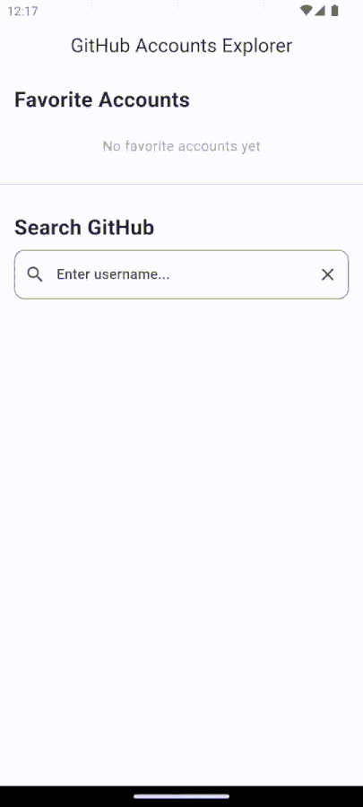

# GitHub Accounts Explorer

A Flutter application that allows you to search and explore GitHub user profiles and their repositories. Built with Flutter and the GitHub REST API.

## App Demo

The demo below shows:
- Searching for and favoriting the Facebook organization
- Searching for and favoriting the GitHub organization
- Navigating to Facebook's profile, scrolling through lazy-loaded repositories, and copying a repository URL



## Features

- Search GitHub users with real-time results
- View detailed user profiles including:
  - Profile information
  - Bio
  - Statistics (followers, following, repositories)
  - List of public repositories
- Like/bookmark favorite users for quick access
- Copy repository URLs with a single tap
- Adaptive app icon for Android 8.0+
- Dark mode support

## Testing

### Generate Mocks
Before running tests, generate the required mock files:
```bash
flutter pub run build_runner build --delete-conflicting-outputs
```

### Unit Tests
Run unit tests with:
```bash
flutter test
```

### Integration Tests
Run integration tests on a connected device or emulator:
```bash
flutter drive \
  --driver=test_driver/integration_test.dart \
  --target=integration_test/app_test.dart
```

Note: Integration tests require a device or emulator to be connected.

## Getting Started

### Prerequisites

- Flutter SDK (3.5.0 or higher)
- Dart SDK (3.5.4 or higher)
- Android Studio / VS Code with Flutter extensions
- (Optional) A GitHub account for creating an access token - without a token, the app will work with a lower API rate limit (10 requests/minute vs 30 requests/minute with token)

### Installation

1. Clone the repository:
```bash
git clone https://github.com/ChrisViljoen/github_accounts_explorer.git
cd github_accounts_explorer
```

2. Install dependencies:
```bash
flutter pub get
```

### Running the App

#### Without GitHub Token (Limited API access)
```bash
flutter run
```
Note: Without a token, you'll be limited to 10 requests per minute for the Search API.

#### With GitHub Token (Recommended)
1. Create a GitHub token:
   - Go to GitHub Settings → Developer settings → Personal access tokens → Generate new token
   - Generate and copy your token

2. Run the app with your token:
```bash
flutter run --dart-define=GITHUB_TOKEN=your_token_here
```

Note: With a token, you'll have a higher rate limit of 30 requests per minute for the Search API.

### Building Release APK

#### Without GitHub Token
```bash
flutter build apk --release
```

#### With GitHub Token
```bash
flutter build apk --release --dart-define=GITHUB_TOKEN=your_token_here
```

The APK will be available at: `build/app/outputs/flutter-apk/app-release.apk`

## Architecture

The app follows Clean Architecture principles and uses the BLoC pattern for state management:

- `lib/core/` - Core functionality, configurations, and constants
- `lib/data/` - Data layer with repositories, models, and API clients
- `lib/presentation/` - UI layer with screens and BLoCs

## Dependencies

- `flutter_bloc` - State management
- `http` - API communication
- `flutter_secure_storage` - Secure token storage
- `sqflite` - Local database for liked users
- `intl` - Date formatting

## License

This project is licensed under the MIT License - see the [LICENSE](LICENSE) file for details.
